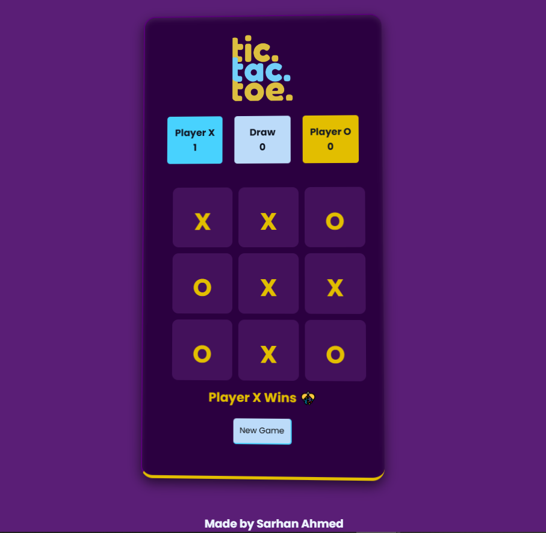

## 👋 Hi, I’m Sarhan

Welcome to my GitHub profile! I’m a **Software Engineering student** passionate about building simple, UI-friendly applications and exploring full-stack development.

### 🚀 What I’m Learning

* Core programming in **C, Java (OOP), and JavaScript**
* **Web development** with HTML, CSS, and modern frameworks
* **Backend fundamentals** with Node.js, Express.js & Mongo DB

### 💡 What I Do Here

* Share my **study projects & practice exercises**
* Devolop useful web apps integrated with AI such as OpenAI, Deepseek, Gemini
* Build **mini apps & games** to strengthen concepts
* Explore **open-source contributions** as I grow

### 🎯 Current Goals

* Devolop ** UI-friendly**  web apps using modern technologies such as MERN
* Explore **backend technologies** like NodeJS, ExpressJS, Flask(Python)
* Efficiently **integrate AI**, to build smart & scalable softwares
* Explore **AI automation** & how to devolop appplications around them

---

## 🚀 Projects

### 🎨 HTML, CSS & JavaScript Projects

  

<b>Tic Tac Toe Game 🎮</b>
  

A fun and interactive browser-based **Tic Tac Toe** game, built with pure **HTML, CSS, and JavaScript**.
A modern Tic Tac Toe game built with HTML, CSS, and JavaScript. The game offers **smooth animations**, a **score-tracking system**, and **sound effects** for an engaging experience. Designed to be fun, **responsive**, and easy to play for all ages.

🔗 [View Repository](https://github.com/SarhanCoderOfTheCentury/Tic-Tac-Toe-Game)

  

  

---

### 💻 University Projects

  

<b>AI-Powered Health Consultancy System 🚑</b>
  

A **Java + MySQL system** that:

* Registers patients & stores their data in a database
* Logs consultations with AI-generated advice
* Integrates **DeepSeek AI API** for medical guidance

🔗 [View Repository](https://github.com/SarhanCoderOfTheCentury/AI-Health-Consultant)

  

---

 
<b>Mini Banking System 🏦 (C Project)</b>

A **C-based file handling system** that:

- Creates and manages multiple bank accounts  
- Allows deposits, withdrawals, and balance checks  
- Saves and updates account data in a text file (`accounts.txt`)  
- Beginner-friendly project demonstrating **structures + file I/O in C**

🔗 [View Repository](#) (https://github.com/SarhanCoderOfTheCentury/Mini-Banking-System.git)

---

### 🤝 Let’s Connect

* 💼 [LinkedIn](https://www.linkedin.com/in/sarhan-ahmed-1935b9341?utm_source=share&utm_campaign=share_via&utm_content=profile&utm_medium=android_app)
* 🌐 [Portfolio Website]

